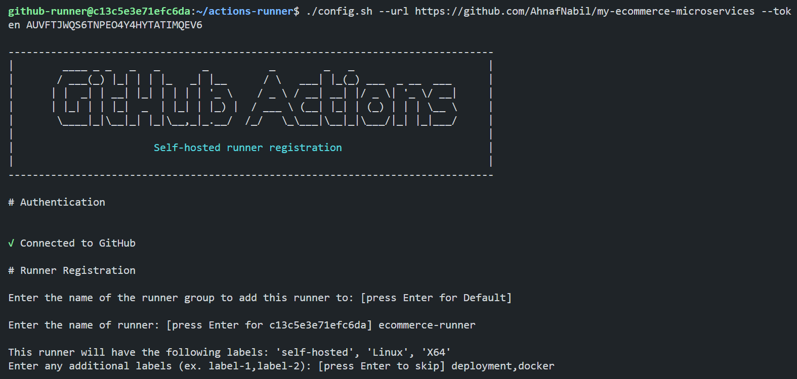
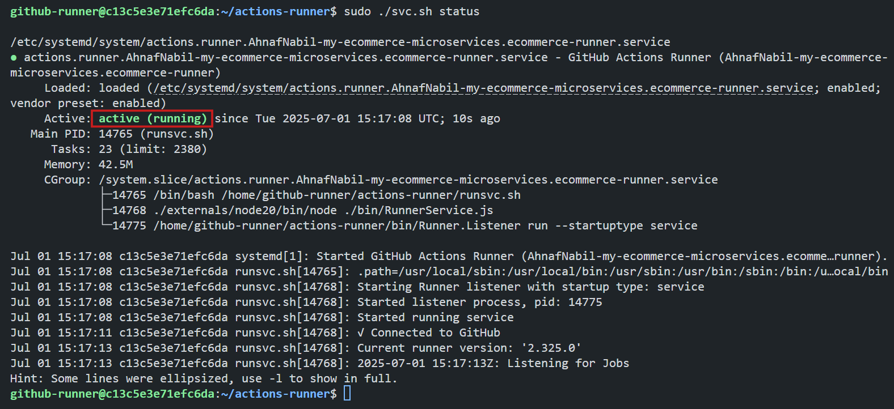
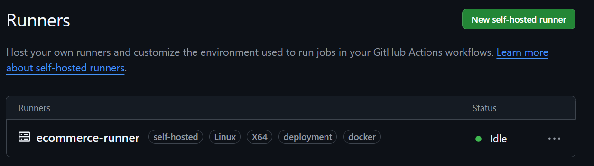
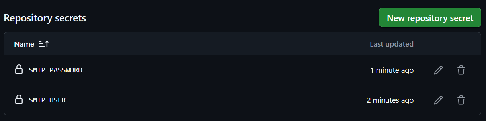
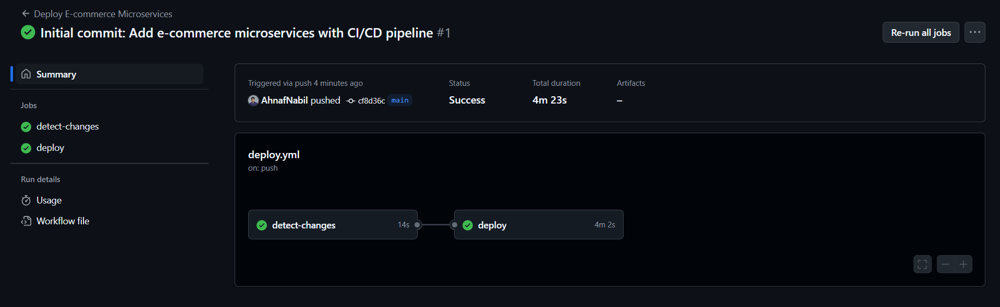
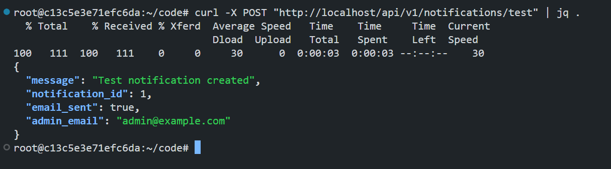
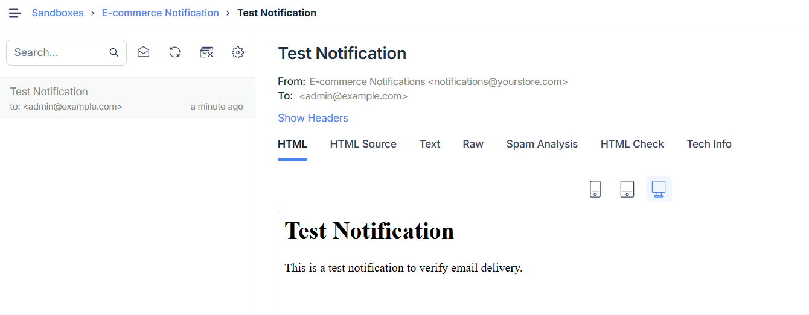
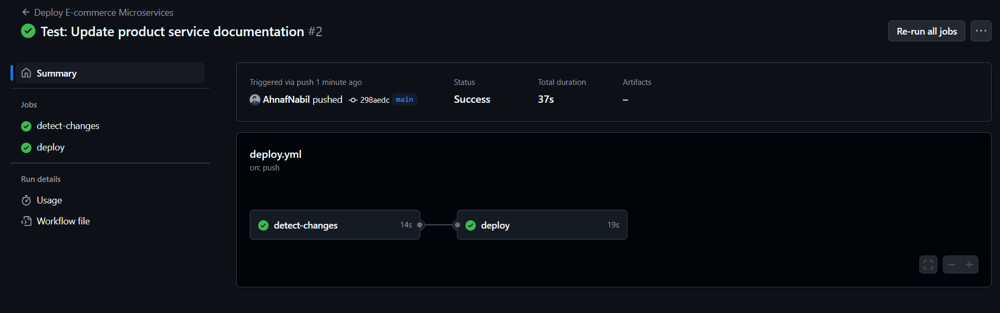
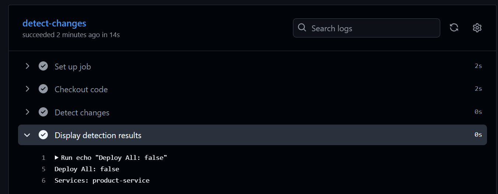

# Building a CI/CD Pipeline for E-commerce Microservices with GitHub Actions

This lab provides a step-by-step guide to implementing a CI/CD pipeline for an e-commerce microservices application using GitHub Actions with self-hosted runners. By leveraging a public repository, you will create your own repository, set up automated deployments with smart change detection, and manage secure credentials using GitHub Secrets. This hands-on lab ensures a production-ready pipeline that deploys only modified services efficiently.

## Task Overview


**In this hands-on lab, we will:**
- Create a new GitHub repository and prepare the codebase.
- Set up an Ubuntu server with Docker and a GitHub self-hosted runner.
- Configure scripts to detect changes and deploy services selectively.
- Create a GitHub Actions workflow for automated deployment.
- Securely manage environment variables with GitHub Secrets.
- Test the pipeline with various scenarios (initial deployment, single service changes, infrastructure updates, and notification service updates).
- Verify the pipeline functionality and ensure services are running.

By the end of this lab, you will have a fully automated CI/CD pipeline that deploys e-commerce microservices to a self-hosted server, with intelligent change detection and secure credential management.

## Key Concepts

### Why CI/CD with GitHub Actions?

CI/CD (Continuous Integration/Continuous Deployment) automates the process of building, testing, and deploying code changes, reducing manual effort and ensuring consistency. GitHub Actions enables customizable workflows to automate these tasks, with self-hosted runners providing control over the deployment environment.

### What is GitHub Actions?

GitHub Actions is a platform for automating workflows directly within a GitHub repository. It supports CI/CD by triggering actions (like deployment) on events such as code pushes, using YAML-based workflow files.

**Key Features:**
- Runs on self-hosted or GitHub-hosted runners.
- Supports parallel job execution and dependency management.
- Integrates with GitHub Secrets for secure credential management.

### What is a Self-Hosted Runner?

A self-hosted runner is a server you manage that executes GitHub Actions workflows. It provides flexibility to customize the environment, install dependencies like Docker, and control resource allocation.

### How the Pipeline Works

- **Change Detection:** A script identifies modified files to determine which services need deployment.
- **Secure Deployment:** Environment variables are injected from GitHub Secrets, ensuring sensitive data is protected.
- **Selective Deployment:** Only changed services or the entire stack (if infrastructure files like `docker-compose.yml` are modified) are deployed.
- **Verification:** Post-deployment checks confirm services are running and accessible.

## Step 1: Set Up Your GitHub Repository

We will create a new GitHub repository and prepare the codebase locally by cloning the source repository.

### 1.1 Create a New GitHub Repository

1. Navigate to [GitHub](https://github.com).
2. Click the **"+"** icon in the top-right corner and select **"New repository"**.
3. Configure the repository:
   - **Repository name**: `my-ecommerce-microservices` (or your preferred name).
   - **Description**: `E-commerce microservices with CI/CD pipeline`.
   - **Visibility**: Public.
   - **Initialize**: Do NOT check "Add a README file" (leave empty).
4. Click **"Create repository"**.

### 1.2 Prepare the Codebase Locally

At first, setup Github default account in `Poridhi's Vscode`.

```bash
git config --global user.email "<your-email>"
git config --global user.name "<Your-username>"
```

Run the following commands to clone the source repository and set up your own:

```bash
# Clone the original public repository
git clone https://github.com/poridhioss/E-Commerce-Ci-Cd.git my-ecommerce-repo

# Navigate into the cloned directory
cd my-ecommerce-repo

# Remove the original git history
rm -rf .git

# Initialize new git repository
git init

# Add your repository as remote (replace with your actual repository URL)
git remote add origin https://github.com/YOUR-USERNAME/my-ecommerce-microservices.git
```

> **NOTE:** Do not push the code yet, as we need to add the CI/CD workflow files first.

## Step 2: Prepare the Deployment Server

Set up an Ubuntu server with Docker and necessary tools to act as the self-hosted runner.

### 2.1 Update the Server

We will use `Poridhi's Vscode` as a server for self-hosted runner. Open a new terminal and update the server:

```bash
sudo apt update
```

### 2.2 Check Docker and Docker Compose Installation

Check if Docker and Docker Compose are already installed:

```bash
docker --version
docker-compose --version
```

### 2.3 Install `jq` for JSON parsing

```bash
sudo apt-get install -y jq
```

### 2.4 Create a Dedicated Runner User

Create a user for the GitHub Actions runner and add it to necessary groups:

```bash
# Create user
sudo adduser github-runner

# When prompted, enter:
# - Password: [choose a secure password]
# - Full name: GitHub Runner
# - Other fields: [press Enter to skip]

# Add user to required groups
sudo usermod -aG sudo github-runner
sudo usermod -aG docker github-runner

# Switch to the new user
su - github-runner
```

## Step 3: Configure the GitHub Self-Hosted Runner

Set up a self-hosted runner on the server to execute GitHub Actions workflows.

### 3.1 Obtain Runner Configuration

1. Go to your GitHub repository.
2. Navigate to **Settings → Actions → Runners**.
3. Click **"New self-hosted runner"** and select **Linux**.
4. Keep the page open to copy the configuration commands.

### 3.2 Download and Configure the Runner

Run these commands as the `github-runner` user:

```bash
# Create runner directory
mkdir actions-runner && cd actions-runner

# Copy the download command from GitHub and run it
# Example (replace with actual command from GitHub):
curl -o actions-runner-linux-x64-2.311.0.tar.gz -L https://github.com/actions/runner/releases/download/v2.311.0/actions-runner-linux-x64-2.311.0.tar.gz

# Extract the installer
tar xzf actions-runner-linux-x64-2.311.0.tar.gz

# Copy the config command from GitHub and run it
# IMPORTANT: Use YOUR repository URL and token from GitHub
./config.sh --url https://github.com/YOUR-USERNAME/YOUR-REPO-NAME --token YOUR-TOKEN
```

When prompted, configure the runner:
```bash
# Enter the name of the runner group: [Press Enter]
# Enter the name of runner: ecommerce-runner
# Enter any additional labels: deployment,docker
# Enter name of work folder: [Press Enter]
```



### 3.3 Install and Start the Runner Service

```bash
# Install the service
sudo ./svc.sh install

# Start the service
sudo ./svc.sh start

# Verify it's running
sudo ./svc.sh status
```



### 3.4 Verify Runner in GitHub

Go to **Settings → Actions → Runners** in your repository. Confirm the runner appears as "Idle".



## Step 4: Create CI/CD Scripts

Add scripts to detect changes and handle deployments locally in your repository.

### 4.1 Navigate to the Repository Directory

```bash
cd my-ecommerce-repo
```

### 4.2 Create Scripts Directory

```bash
mkdir -p .github/scripts
```

### 4.3 Create Change Detection Script

Create `.github/scripts/detect-changes.sh` to identify modified services:

```bash
#!/bin/bash

# detect-changes.sh - Detects which services have changed

set -e

# Service mapping - maps file paths to services
declare -A SERVICE_MAP=(
    ["product-service"]="product-service"
    ["inventory-service"]="inventory-service"
    ["order-service"]="order-service"
    ["user-service"]="user-service"
    ["notification-service"]="notification-service"
    ["nginx"]="nginx-gateway"
    ["docker-compose.yml"]="all"
    ["events"]="product-service inventory-service"
)

# Get changed files between current commit and previous commit
CHANGED_FILES=$(git diff --name-only HEAD~1 HEAD 2>/dev/null || git ls-files)

echo "Changed files:"
echo "$CHANGED_FILES"
echo ""

SERVICES_TO_DEPLOY=""
DEPLOY_ALL=false

# Check each changed file
while IFS= read -r file; do
    if [ -z "$file" ]; then
        continue
    fi
    
    echo "Analyzing: $file"
    
    # Check if it's a service directory
    for service_dir in "${!SERVICE_MAP[@]}"; do
        if [[ "$file" == "$service_dir"* ]]; then
            services="${SERVICE_MAP[$service_dir]}"
            if [ "$services" = "all" ]; then
                DEPLOY_ALL=true
                break
            else
                for service in $services; do
                    if [[ ! " $SERVICES_TO_DEPLOY " =~ " $service " ]]; then
                        SERVICES_TO_DEPLOY="$SERVICES_TO_DEPLOY $service"
                    fi
                done
            fi
            break
        fi
    done
done <<< "$CHANGED_FILES"

# Output results
if [ "$DEPLOY_ALL" = true ]; then
    echo "DEPLOY_ALL=true" >> $GITHUB_OUTPUT
    echo "SERVICES=" >> $GITHUB_OUTPUT
    echo "Deploying all services due to infrastructure changes"
else
    SERVICES_TO_DEPLOY=$(echo "$SERVICES_TO_DEPLOY" | xargs)
    echo "DEPLOY_ALL=false" >> $GITHUB_OUTPUT
    echo "SERVICES=$SERVICES_TO_DEPLOY" >> $GITHUB_OUTPUT
    echo "Services to deploy: $SERVICES_TO_DEPLOY"
fi
```

### 4.4 Create Deployment Script

Create `.github/scripts/deploy.sh` to handle service deployment and environment variable injection:

```bash
#!/bin/bash

# deploy.sh - Main deployment script with environment variable injection

set -e

DEPLOY_ALL=${1:-false}
SERVICES=${2:-""}
APP_DIR="/opt/ecommerce-app"

echo "=== E-commerce Microservices Deployment ==="
echo "Deploy All: $DEPLOY_ALL"
echo "Services: $SERVICES"
echo "Working Directory: $APP_DIR"
echo ""

# Change to application directory
cd "$APP_DIR"

# Pull latest code
echo "Pulling latest code..."
git fetch origin
git reset --hard origin/main
echo "✓ Code updated"

# Create/Update environment files with secrets
create_env_files() {
    echo "Setting up environment variables..."
    
    # Update notification service .env file
    if [ -f "notification-service/.env" ]; then
        # Backup original
        cp notification-service/.env notification-service/.env.backup
        
        # Update SMTP credentials if provided
        if [ -n "$SMTP_USER" ]; then
            sed -i "s/^SMTP_USER=.*/SMTP_USER=${SMTP_USER}/" notification-service/.env
        fi
        if [ -n "$SMTP_PASSWORD" ]; then
            sed -i "s/^SMTP_PASSWORD=.*/SMTP_PASSWORD=${SMTP_PASSWORD}/" notification-service/.env
        fi
        
        echo "✓ Updated notification service environment variables"
    else
        echo "⚠️ Warning: notification-service/.env not found"
    fi
}

# Function to deploy all services
deploy_all_services() {
    echo "Deploying all services..."
    
    create_env_files
    
    echo "Stopping all services..."
    docker-compose down
    
    echo "Pulling latest images..."
    docker-compose pull 2>/dev/null || echo "Building images locally..."
    
    echo "Building and starting all services..."
    docker-compose up -d --build
    
    echo "✓ All services deployed"
}

# Function to deploy specific services
deploy_specific_services() {
    local services=($1)
    
    echo "Deploying specific services: ${services[*]}"
    
    # Update env files if notification-service is being deployed
    for service in "${services[@]}"; do
        if [ "$service" = "notification-service" ]; then
            create_env_files
            break
        fi
    done
    
    for service in "${services[@]}"; do
        if [ -z "$service" ]; then
            continue
        fi
        
        echo "Deploying service: $service"
        
        # Pull latest image for the service
        docker-compose pull "$service" 2>/dev/null || echo "No pre-built image for $service, will build locally"
        
        # Build and restart the service
        docker-compose up -d --build --no-deps "$service"
        
        echo "✓ Service $service deployed"
        
        # Wait a moment for service to start
        sleep 5
    done
}

# Execute deployment
if [ "$DEPLOY_ALL" = "true" ]; then
    deploy_all_services
else
    if [ -n "$SERVICES" ]; then
        deploy_specific_services "$SERVICES"
    else
        echo "No services to deploy"
    fi
fi

echo ""
echo "=== Deployment completed successfully ==="

# Show running services
echo ""
echo "Running services:"
docker-compose ps
```

## Step 5: Create GitHub Actions Workflow

Define the CI/CD workflow to automate deployment on code pushes.

### 5.1 Create Workflow Directory

```bash
mkdir -p .github/workflows
```

### 5.2 Create Deployment Workflow

Create `.github/workflows/deploy.yml` to orchestrate the deployment process:

```bash
name: Deploy E-commerce Microservices

on:
  push:
    branches: [ main ]

jobs:
  detect-changes:
    runs-on: self-hosted
    outputs:
      deploy_all: ${{ steps.detect.outputs.DEPLOY_ALL }}
      services: ${{ steps.detect.outputs.SERVICES }}
    steps:
      - name: Checkout code
        uses: actions/checkout@v4
        with:
          fetch-depth: 2

      - name: Detect changes
        id: detect
        run: |
          chmod +x .github/scripts/detect-changes.sh
          .github/scripts/detect-changes.sh

      - name: Display detection results
        run: |
          echo "Deploy All: ${{ steps.detect.outputs.DEPLOY_ALL }}"
          echo "Services: ${{ steps.detect.outputs.SERVICES }}"

  deploy:
    needs: detect-changes
    runs-on: self-hosted
    steps:
      - name: Verify application directory
        run: |
          # Check if directory exists and has proper ownership
          if [ ! -d "/opt/ecommerce-app" ]; then
            echo "❌ Application directory does not exist."
            echo "Please run on server: sudo mkdir -p /opt/ecommerce-app && sudo chown -R github-runner:github-runner /opt/ecommerce-app"
            exit 1
          fi
          
          # Verify we have write access
          if [ ! -w "/opt/ecommerce-app" ]; then
            echo "❌ No write access to /opt/ecommerce-app"
            echo "Please run on server: sudo chown -R github-runner:github-runner /opt/ecommerce-app"
            exit 1
          fi
          
          echo "✅ Application directory verified"
          ls -la /opt/ecommerce-app
          
      - name: Initialize or update repository
        run: |
          cd /opt/ecommerce-app
          
          if [ ! -d ".git" ]; then
            echo "🔄 First time setup - cloning repository..."
            git clone https://github.com/${{ github.repository }}.git .
          else
            echo "✅ Repository exists - updating..."
            git fetch origin
            git reset --hard origin/main
          fi
          
          echo "📁 Repository status:"
          git status --short

      - name: Deploy services
        env:
          SMTP_USER: ${{ secrets.SMTP_USER }}
          SMTP_PASSWORD: ${{ secrets.SMTP_PASSWORD }}
        run: |
          cd /opt/ecommerce-app
          chmod +x .github/scripts/deploy.sh
          .github/scripts/deploy.sh "${{ needs.detect-changes.outputs.deploy_all }}" "${{ needs.detect-changes.outputs.services }}"

      - name: Deployment summary
        run: |
          echo "🚀 Deployment completed successfully!"
          echo "Deploy All: ${{ needs.detect-changes.outputs.deploy_all }}"
          echo "Services: ${{ needs.detect-changes.outputs.services }}"
          cd /opt/ecommerce-app
          echo ""
          echo "Running services:"
          docker-compose ps
```

## Step 6: Configure GitHub Secrets for Secure Credentials

Set up environment variables for the notification service using GitHub Secrets.

### 6.1 Obtain Mailtrap Credentials

1. Log in to [Mailtrap.io](https://mailtrap.io).
2. Navigate to **Sandbox** and select your inbox.
3. Go to **SMTP Settings** and copy the username and password.

### 6.2 Add Secrets to GitHub

1. In your GitHub repository, go to **Settings → Secrets and variables → Actions**.
2. Click **"New repository secret"** and add the following:

```
Name: SMTP_USER
Value: [your_mailtrap_username_from_step_6.1]

Name: SMTP_PASSWORD
Value: [your_mailtrap_password_from_step_6.1]
```

### 6.3 Verify Secrets

Confirm that the two secrets (`SMTP_USER`, `SMTP_PASSWORD`) are listed in the repository’s secrets section.



## Step 7: Create the Application Directory

Create the application directory where the code will be deployed.

```bash
sudo mkdir -p /opt/ecommerce-app
sudo chown -R github-runner:github-runner /opt/ecommerce-app
```

Verify permissions:

```bash
ls -la /opt/ | grep ecommerce-app
```

## Step 8: Commit and Push the Codebase

Push the codebase and CI/CD scripts to trigger the initial deployment.

### 8.1 Commit and Push

```bash
# Add all files including the original codebase and new CI/CD files
git add .

# Check what will be committed
git status

# Make the initial commit
git commit -m "Initial commit: Add e-commerce microservices with CI/CD pipeline"

# Rename the current branch from master to main
git branch -M master main

# Push to your repository
git push -u origin main
```

## Step 9: Verify Initial Deployment

Check that the pipeline executes and deploys all services successfully.

### 9.1 Monitor Workflow Execution

1. In your GitHub repository, go to the **Actions** tab.
2. Locate the "Deploy E-commerce Microservices" workflow run and click to view details.

**Expected Workflow Steps:**
- Clone the repository to the server.
- Detect changes (all files are new, so deploy all services).
- Inject environment variables for the notification service.
- Deploy all services.
- Display the final status.



### 9.2 Verify Services on the Server

As the `github-runner` user, check running services:

```bash
# Switch to github-runner user
su - github-runner

# Check services
cd /opt/ecommerce-app
docker-compose ps
```

**Expected Output:** All services (e.g., product-service, inventory-service, etc.) should be in the "Up" state.

### 9.3 Test Notification Service

Verify email functionality:

```bash
curl -X POST "http://localhost/api/v1/notifications/test" | jq .
```



Check your Mailtrap inbox for a test email.



## Step 10: Test Single Service Deployment

Test the pipeline’s ability to deploy only modified services.

### 10.1 Modify a Single Service

```bash
# Make a small change to product service
echo "# Updated $(date)" >> product-service/README.md

# Commit and push
git add product-service/README.md
git commit -m "Test: Update product service documentation"
git push origin main
```

### 10.2 Monitor Workflow

1. Go to the **Actions** tab in your GitHub repository.
2. Verify that only `product-service` is redeployed in the workflow logs.





### 10.3 Verify Selective Deployment

On the server:

```bash
cd /opt/ecommerce-app
docker-compose ps

# Check logs to confirm only product-service was restarted
docker-compose logs --tail=20 product-service
```

**Expected Output:** Logs show only `product-service` was redeployed.

## Conclusion

This lab demonstrated how to build a robust CI/CD pipeline for e-commerce microservices using GitHub Actions with a self-hosted runner. You automated infrastructure setup, implemented smart change detection, and ensured secure credential management with GitHub Secrets. The pipeline supports selective service deployment, full stack updates, and notification service testing, providing a scalable and production-ready solution for microservices deployment.